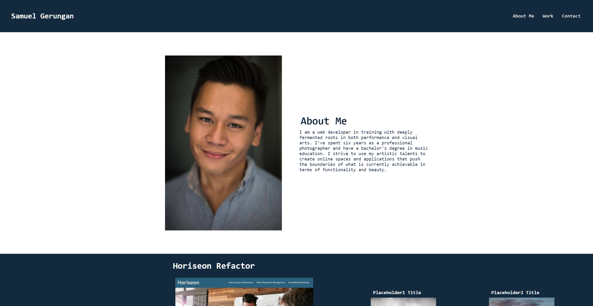

# SamG-Portfolio

This is a constantly evolving portfolio that showcases both my creative and techical capabilities as a web developer.

## Description

This portfolio is a representation of my work, character, and journey as a creative and innovative developer. The page will constantly be improved upon as I hone my coding skills into the future. This portfolio will be used to showcase my capabilities thus far for the purpose of appealing to potential employers.

## Image of Webpage

## Link of Webpage

https://sam-t-g.github.io/SamG-Portfolio/

## License

MIT License

Copyright (c) 2022 Samuel Gerungan

Permission is hereby granted, free of charge, to any person obtaining a copy of this software and associated documentation files (the "Software"), to deal in the Software without restriction, including without limitation the rights to use, copy, modify, merge, publish, distribute, sublicense, and/or sell copies of the Software, and to permit persons to whom the Software is furnished to do so, subject to the following conditions:

The above copyright notice and this permission notice shall be included in all copies or substantial portions of the Software.

THE SOFTWARE IS PROVIDED "AS IS", WITHOUT WARRANTY OF ANY KIND, EXPRESS OR IMPLIED, INCLUDING BUT NOT LIMITED TO THE WARRANTIES OF MERCHANTABILITY, FITNESS FOR A PARTICULAR PURPOSE AND NONINFRINGEMENT. IN NO EVENT SHALL THE AUTHORS OR COPYRIGHT HOLDERS BE LIABLE FOR ANY CLAIM, DAMAGES OR OTHER LIABILITY, WHETHER IN AN ACTION OF CONTRACT, TORT OR OTHERWISE, ARISING FROM, OUT OF OR IN CONNECTION WITH THE SOFTWARE OR THE USE OR OTHER DEALINGS IN THE SOFTWARE.
